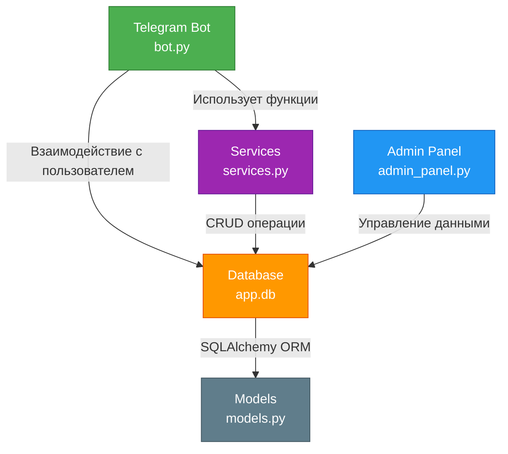

# TeleFood: Система Заказа Еды в Telegram

## Обзор

TeleFood - это система заказа еды в Telegram, которая позволяет пользователям просматривать меню, добавлять продукты в корзину и совершать заказы. Система состоит из трех основных компонентов:

### Основные функции системы

TeleFood предоставляет следующий функционал для пользователей и администраторов:

* **Просмотр меню и категорий**: Пользователи могут просматривать доступные категории блюд (например, пицца, суши, бургеры) и выбирать продукты из этих категорий.
* **Добавление продуктов в корзину**: Возможность добавлять выбранные продукты в корзину для последующего заказа.
* **Управление корзиной**: Пользователи могут просматривать содержимое корзины, очищать её или оформлять заказ из корзины.
* **Оформление заказов**: Поддержка процесса оформления заказа с выбором способа оплаты (онлайн или наличными).
* **Просмотр истории заказов**: Пользователи могут видеть список своих предыдущих заказов с деталями по каждому из них.
* **Оставление отзывов**: Возможность оставлять отзывы как на отдельные заказы, так и общую обратную связь для администраторов.
* **Управление данными через панель администратора**: Администраторы могут добавлять, удалять и обновлять информацию о продуктах, категориях и заказах через графический интерфейс.

### Архитектура проекта
Для наглядности ниже представлена диаграмма архитектуры проекта:



* **Telegram-бот**: Обрабатывает взаимодействие с пользователями, отправляет сообщения и получает обновления.
* **Панель администратора**: Графический интерфейс для администраторов, позволяющий управлять продуктами, категориями и заказами.
* **Сервисы**: Модуль Python, предоставляющий функции для работы с базой данных, управления пользователями и обработки заказов.

## Компоненты

### Telegram-бот

Telegram-бот построен с использованием библиотеки `telebot` и отвечает за:

* Обработку сообщений и колбэков от пользователей
* Отправку меню, информации о продуктах и обновлений заказов
* Получение ввода от пользователей и обновление базы данных

Бот определяется в файле `bot.py` и использует класс `TeleFoodBot` для управления его функциональностью. Обработчики пользовательских взаимодействий модульно организованы в директории `handlers/`, что улучшает читаемость и поддержку кода.

#### Функции Telegram-бота

* **Роуты**:
	+ `/start`: Начать взаимодействие с ботом
	+ `/menu`: Просмотреть меню
	+ `/cart`: Просмотреть корзину
	+ `/order`: Совершить заказ
	+ `/help`: Получить помощь
* **Кнопки выбора**:
	+ **Меню**: Просмотреть меню и выбрать категорию
	+ **Категории**: Просмотреть продукты в выбранной категории
	+ **Продукты**: Просмотреть информацию о продукте и добавить в корзину
	+ **Корзина**: Просмотреть корзину и совершить заказ
	+ **Заказ**: Совершить заказ и получить информацию о статусе заказа

#### Примеры использования кнопок выбора

* **Меню**:
	+ Выберите категорию: "Пицца", "Суши", "Бургеры"
	+ Выберите продукт: "Пицца Маргарита", "Суши с лососем", "Бургер с говядиной"
* **Категории**:
	+ Выберите категорию: "Пицца", "Суши", "Бургеры"
	+ Выберите продукт: "Пицца Маргарита", "Суши с лососем", "Бургер с говядиной"
* **Продукты**:
	+ Выберите продукт: "Пицца Маргарита", "Суши с лососем", "Бургер с говядиной"
	+ Добавьте в корзину: "Пицца Маргарита", "Суши с лососем", "Бургер с говядиной"

### Панель администратора

Панель администратора построена с использованием `tkinter` и предоставляет графический интерфейс для администраторов, позволяющий:

* Управлять продуктами и категориями
* Просматривать и обновлять заказы
* Инициализировать базу данных

Панель администратора определяется в файле `admin_panel.py` и использует класс `AdminPanel` для управления его функциональностью.

#### Функции панели администратора

* **Управление продуктами**:
	+ Добавить продукт
	+ Удалить продукт
	+ Обновить информацию о продукте
* **Управление категориями**:
	+ Добавить категорию
	+ Удалить категорию
	+ Обновить информацию о категории
* **Управление заказами**:
	+ Просмотреть заказы
	+ Обновить статус заказа
	+ Удалить заказ

### Сервисы

Модуль Сервисы предоставляет функции для:

* Работы с базой данных (например, создание пользователей, получение продуктов)
* Управления пользователями (например, создание пользователей, обновление информации о пользователях)
* Обработки заказов (например, добавление продуктов в корзину, совершение заказов)

Модуль Сервисы определяется в файле `services.py` и использует объект `Session` из `sqlalchemy` для взаимодействия с базой данных.

## База данных

Проект использует базу данных SQLite для хранения данных. Схема базы данных определяется в файле `models.py` и включает таблицы для:

* Пользователей
* Продуктов
* Категорий
* Заказов
* Корзин

## Требования

Проект требует следующих зависимостей и технических условий:

* **Python 3.6+** - основной язык программирования, необходимый для работы всех компонентов системы.
* **`telebot`** - библиотека для взаимодействия с Telegram Bot API, используется для создания и управления ботом.
* **`tkinter`** - библиотека для создания графического интерфейса, используется в панели администратора.
* **`sqlalchemy`** - ORM-библиотека для работы с базой данных, обеспечивает взаимодействие между кодом и SQLite.
* **`python-dotenv`** - библиотека для работы с переменными окружения, необходима для безопасной настройки API-токенов и других конфиденциальных данных.
* **SQLite** - легковесная база данных, используемая для хранения данных о пользователях, продуктах, категориях, заказах и корзинах.
* **Telegram API Token** - необходим для аутентификации бота в Telegram, должен быть указан в переменных окружения.

## Используемые технологии

В проекте TeleFood используются следующие технологии и инструменты:

* **Python** - основной язык программирования.
* **Telegram Bot API** (через библиотеку `telebot`) - для создания и управления Telegram-ботом.
* **Tkinter** - для разработки графического интерфейса панели администратора.
* **SQLAlchemy** - для работы с базой данных через ORM (Object-Relational Mapping).
* **SQLite** - легковесная база данных для хранения информации о пользователях, продуктах, заказах и т.д.
* **python-dotenv** - для управления переменными окружения и настройки конфиденциальных данных.

## Установка

Чтобы установить и настроить проект, выполните следующие шаги:

1. **Клонируйте репозиторий**:
   ```bash
   git clone https://github.com/Vgoroveckiy/telefoods.git
   cd telefoods
   ```

2. **Установите зависимости**:
   ```bash
   pip install -r requirements.txt
   ```

3. **Настройте переменные окружения**:
   Создайте файл `.env` в корневой директории проекта и добавьте ваш Telegram API Token:
   ```
   TELEGRAM_BOT_TOKEN=your_bot_token_here
   ```

4. **Инициализируйте базу данных**:
   Запустите панель администратора для создания базы данных SQLite:
   ```bash
   python admin_panel.py
   ```

## Использование

1. **Запустите Telegram-бот**:
   ```bash
   python bot.py
   ```
   Бот начнет опрашивать обновления и будет готов к взаимодействию. Найдите вашего бота в Telegram и начните с команды `/start`.

2. **Используйте панель администратора**:
   Запустите `admin_panel.py` (если еще не запущен) для управления продуктами и категориями через графический интерфейс:
   ```bash
   python admin_panel.py
   ```

3. **Взаимодействие с ботом**:
   - Отправляйте команды и используйте кнопки для навигации по меню, добавления продуктов в корзину и оформления заказов.
   - Используйте команды `/menu`, `/cart` и `/orders` для быстрого доступа к основным функциям.

## Структура проекта

Проект организован следующим образом для улучшения читаемости и поддержки кода:

- **bot.py**: Основной скрипт для запуска Telegram-бота, инициализирует класс `TeleFoodBot` и регистрирует обработчики.
- **config.py**: Центральный файл конфигурации, содержащий константы и переменные окружения, такие как API-токен и меню.
- **handlers/**: Директория с модулями обработчиков для различных функций бота:
  - **menu_handler.py**: Обработчик меню, отображает категории и продукты.
  - **cart_handler.py**: Управление корзиной, включая добавление продуктов и оформление заказов.
  - **order_handler.py**: Отображение истории заказов пользователя.
  - **feedback_handler.py**: Обработка отзывов и обратной связи.
- **admin_panel.py**: Графический интерфейс для администраторов на основе Tkinter.
- **services.py**: Бизнес-логика и функции для работы с базой данных.
- **database.py**: Настройка соединения с базой данных SQLite через SQLAlchemy.
- **models.py**: Определение схемы базы данных с использованием SQLAlchemy ORM.
- **requirements.txt**: Список зависимостей проекта.
- **.env**: Файл для хранения переменных окружения (не включен в репозиторий).
- **tests/**: Директория с тестами для проверки функциональности проекта:
  - **test_services.py**: Юнит-тесты для функций модуля `services.py`, используя `unittest` и in-memory SQLite базу данных.

## Логирование

Проект включает базовое логирование для отслеживания действий пользователей и ошибок. Логи записываются в файл `telefood_bot.log` и выводятся в консоль при запуске `bot.py`.

## Вклад в проект

Если вы хотите внести вклад в развитие TeleFood, следуйте этим шагам:

1. **Форкните репозиторий** и клонируйте его на локальную машину.
2. **Создайте ветку** для вашей функции или исправления ошибки:
   ```bash
   git checkout -b feature/your-feature-name
   ```
3. **Внесите изменения** и протестируйте их локально.
4. **Сделайте коммит** с описательным сообщением:
   ```bash
   git commit -m "Добавлена функция X для улучшения Y"
   ```
5. **Отправьте изменения** в ваш форк:
   ```bash
   git push origin feature/your-feature-name
   ```
6. **Создайте Pull Request** на GitHub, описав ваши изменения и их цель.

Пожалуйста, следуйте стандартным практикам кодирования на Python (PEP 8) и добавляйте документацию к новым функциям или изменениям.

## Лицензия

Этот проект распространяется под лицензией MIT. См. `LICENSE` для подробностей.
